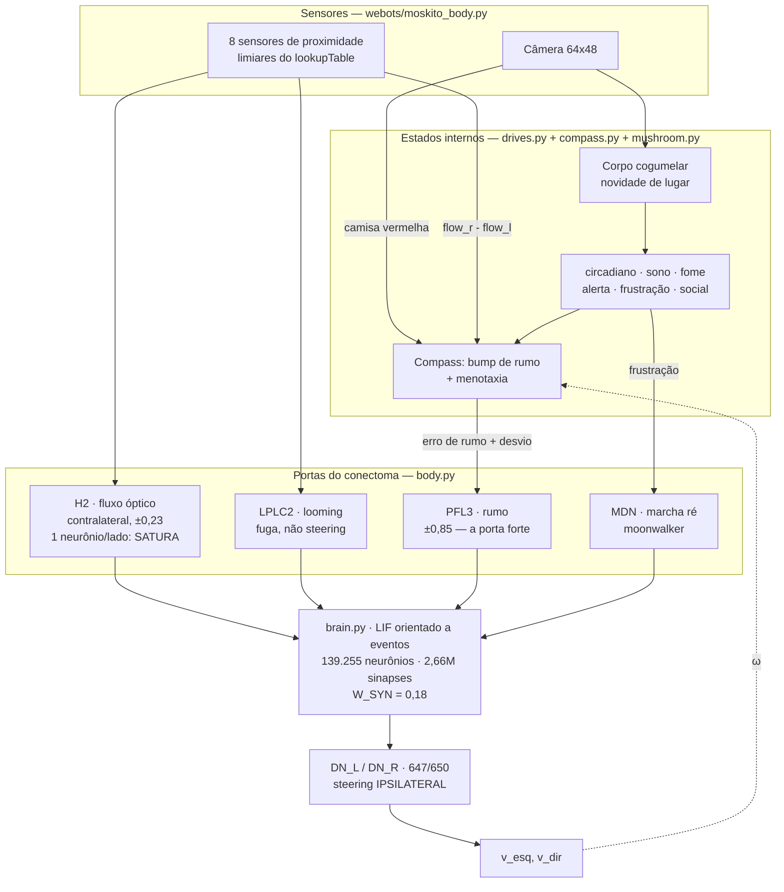

# moskito

Robô autônomo cujo **steering vem do conectoma real da mosca** (FlyWire FAFB
v783), com os estados internos que o conectoma não contém. Validado no Webots;
alvo final é um ESP32-S3 com câmera para o corpo e o cérebro num Mac M1 Max.

---

## Economia de contexto: o que ler e o que NÃO ler

O código inteiro tem **1.242 linhas**. Os dados têm **245 MB**. Ler os dados
estoura o contexto sem entregar nada.

| Caminho | Tamanho | Ação |
|---|---|---|
| `moskito/*.py` | 714 linhas | **Leia tudo.** É o cérebro inteiro. |
| `webots/moskito_body.py` | 162 | Leia ao mexer em sensor/atuador |
| `scripts/{trace,calibrate}.py` | 121 | Leia ao calibrar |
| `webots/make_world.py`, `run.sh` | 129 | Leia só ao mexer no Webots |
| `data/*.csv` | **245 MB** | **NUNCA leia.** Consulte com pandas num script. |
| `data/brain.npz` | 10 MB | Binário. Use `connectome.load()`. |
| `data/ports.json` | 4.240 índices | Leia só as **chaves**: `python -c "import json;print(list(json.load(open('data/ports.json'))))"` |
| `webots/worlds/*.wbt` | 2.093 linhas | Mobília gerada. Use `grep`/`sed -n`, nunca leia inteiro. |
| `.venv/` | — | Ignore |

**Regra:** para qualquer pergunta sobre o conectoma (quantos neurônios do tipo
X, quem conecta em quem), escreva um script pandas de 5 linhas e leia a saída.
Nunca abra o CSV.

---

## Arquitetura



**A fronteira que importa:** `Body` fala em `(v_esq, v_dir)` e nada mais. O
controller do Webots é um adaptador fino, e o firmware do ESP32-S3 vai ocupar
exatamente o mesmo lugar. Nenhuma decisão mora no controller.

---

## O que é conectoma e o que não é

Ser honesto sobre isso no código e nas mensagens. Não inflar.

- **É conectoma:** todo o steering. Rumo e desvio entram pelo PFL3, propagam
  pela fiação real e saem nos descendentes.
- **NÃO é conectoma:** o avanço (`V_CRUISE * drive_forward()`), os seis estados
  internos, e o anel de rumo — o `Compass` modela o *resultado* do anel
  EPG/PEN (fase que integra rotação), não a dinâmica de spikes. EPG, PEN e
  Delta7 estão no conectoma (47/24/42 neurônios) e a classe pode ser trocada
  pela rede real sem mexer no resto.

---

## Números medidos (não re-derive)

| Medida | Valor |
|---|---|
| `W_SYN` calibrado | 0,18 |
| Assimetria DN: PFL3 20 mV | ±0,85 |
| Assimetria DN: H2 40 mV | ±0,23 (satura) |
| Custo do LIF | 15,7 ms de parede por 5 ms biológicos (M1 Max) |
| Simulação resultante | ~1,0× tempo real com passo de 16 ms |
| Velocidade máx. e-puck v2 | 0,154 m/s |
| Cruzeiro medido | 11,2 cm/s |
| Alinhar em 90° | ~2 s, 1,2° residual |
| Corpo cogumelar | 1,00 → 0,011 após 9 visitas |

---

## Armadilhas que já custaram caro

1. **Tipos celulares com 1 neurônio por lado saturam.** `DNa02`, `H2`, `DNp09`
   têm um só. Como *leitor* dão sinal binário instável; como *porta de entrada*
   saturam e injetar mais não muda nada. Prefira populações: `DN_L/DN_R` (647/650)
   para ler, `PFL3` (12/lado) para injetar.

2. **Não calibre pela taxa média da rede.** Com `W_SYN = 1.0` ela dava 11 Hz
   "plausíveis" com `i_syn` em −1800 mV contra limiar de 7 mV — regime saturado
   onde a injeção sensorial é irrelevante. Calibre pela **lateralização**
   (`scripts/calibrate.py`).

3. **Antes do spiking, rode `scripts/trace.py`.** Ele mede influência
   lateralizada no grafo em 1,3 s. Se não há caminho lateralizado, nenhum ajuste
   de `W_SYN` vai criar um. Foi assim que descobrimos que LPLC2 era a porta
   errada (fuga, não steering) e H2 a certa.

4. **Limiares de sensor saem do `lookupTable` do PROTO, não de chute.**
   E-puck: `0mm=4095 5mm=2133 1cm=1466 2cm=384 4cm=158`.

   A terceira coluna do `lookupTable` é **ruído relativo**, e ela invalida o IR
   como medidor de progresso: a 1,5 cm (601 contagens, ruído 0,0406) o desvio
   de uma amostra já é ~24 contagens, e a diferença entre dois passos tem
   desvio ~34. O antigo teste "não mudou" usava limiar 12 sobre o `.max()` dos
   8 sensores — lia ruído puro, o contador de preso zerava toda hora e a
   frustração nunca subia. **Progresso se mede pela câmera**, não pelo IR; do
   IR só sobra o contato (4095 com ruído 0,002 contra limiar 1200), que é
   imune.

5. **Detecção de "não estou saindo do lugar" é cópia eferente × fluxo óptico.**
   Mandei roda e a cena não mudou ⇒ preso, não importa o que o IR diz (debaixo
   da poltrona ele lê 2–5 cm e nunca acusa contato). Comparar com o quadro
   **anterior** não serve: a 11 cm/s são 1,8 mm por passo, deslocamento
   sub-pixel num muro liso, indistinguível de encunhado. A referência visual só
   avança quando a cena mudou de verdade, e `cam_flow` acumula desde a última
   mudança confirmada. Medido: encunhado dispara em 41 passos (~0,66 s) tanto
   em parede texturizada quanto lisa; deslize de 0,05 contagem/passo não
   dispara.

6. **Cena congelada escala direto para ré, sem gastar meia-volta.** Encunhado
   em vão estreito, girar só raspa — `Compass.back_out()` em vez da escalada
   `turn_back` → `turn_back` → ré, que desperdiça 6 s de manobra inútil.

7. **O Webots grava estado dentro do `.wbt`** ao salvar (campos `hidden`,
   posição final). O robô passa a nascer onde travou. Use `make_world.py`.

8. **O `.wbproj` guarda o estado da INTERFACE** e pode conter
   `centralWidgetVisible: 0` ou `renderingMode: WIREFRAME` — a janela abre em
   branco **sem nenhuma mensagem de erro**. Só resolve com o Webots fechado.

9. **Sintoma no simulador ≠ bug no código.** Antes de mexer na lógica, confirme
   que o mundo carrega (`webots --batch --stdout --mode=pause <world>`) e que o
   robô não está preso pela geometria. Já perdemos quatro rodadas por isso.

---

## Comandos

```bash
bash scripts/fetch_data.sh                 # 245 MB do espelho do Codex
.venv/bin/python scripts/build.py          # CSVs -> brain.npz (6 s)
.venv/bin/python scripts/trace.py          # que porta tem influência lateralizada
.venv/bin/python scripts/calibrate.py 0.18 # faixa dinâmica e lateralização
.venv/bin/python scripts/demo.py           # um dia da mosca, sem Webots -> demo.png
```

Webots (o `make_world.py` recusa rodar com o Webots aberto, de propósito):

```bash
pkill -f "Webots.app/Contents/MacOS/webots"
.venv/bin/python webots/make_world.py      # zera mundo E interface
open -a Webots webots/worlds/moskito_apartment.wbt
bash webots/run.sh                         # com a simulação em play
```

---

## Como me pedir trabalho aqui

O que funciona melhor neste projeto, na ordem:

1. **Diga o sintoma observado, não a causa suspeita.** "ele gira devagar perto
   da parede" rendeu mais que "aumente o ganho angular" — a causa real era
   autoridade de curva, não ganho.
2. **Mande o log.** A linha do `run.sh` tem `frust`, `sono`, `psmax`, `DN L/R` e
   `v=`. Com esses cinco dá para localizar o elo quebrado sem adivinhar.
3. **Peça medição antes de correção.** Todo número neste arquivo veio de um
   script que roda em segundos. Chute custa mais caro que medir.
4. **Um sintoma por vez.** Quando dois se misturam (travado + devagar), o
   segundo costuma ser consequência do primeiro.

---

## Estado atual e próximos passos

Funciona: steering pelo conectoma, ciclo circadiano, corpo cogumelar,
frustração → MDN, escalada de fuga (meia-volta → ré reta), busca por pessoa.

Aberto, em ordem de valor:

1. **Avanço não vem do conectoma.** No ponto de operação a população
   descendente fica em 0–1 Hz e `DNp09` não dispara nem com injeção acima do
   limiar. Hipótese: falta o drive sensorial distribuído que a mosca real tem
   (~17k sensoriais + 78k ópticos ativos o tempo todo) — testar injetando ruído
   de fundo nas populações sensoriais.
2. **Porta olfativa de verdade.** O "cheiro" da base entra pelas LC11; falta
   resolver os ORNs do lobo antenal.
3. **Trocar o `Compass` pela rede EPG/PEN/Delta7 real.**
4. **Escala:** o e-puck tem 7 cm num apartamento real e encunha em vãos que um
   robô doméstico nem notaria. Decisão consciente de manter, não descuido.

## Dados

FlyWire FAFB v783 sob **CC BY-NC 4.0** — uso não comercial. Citação em
<https://flywire.ai/guidelines>. CSVs não versionados.
