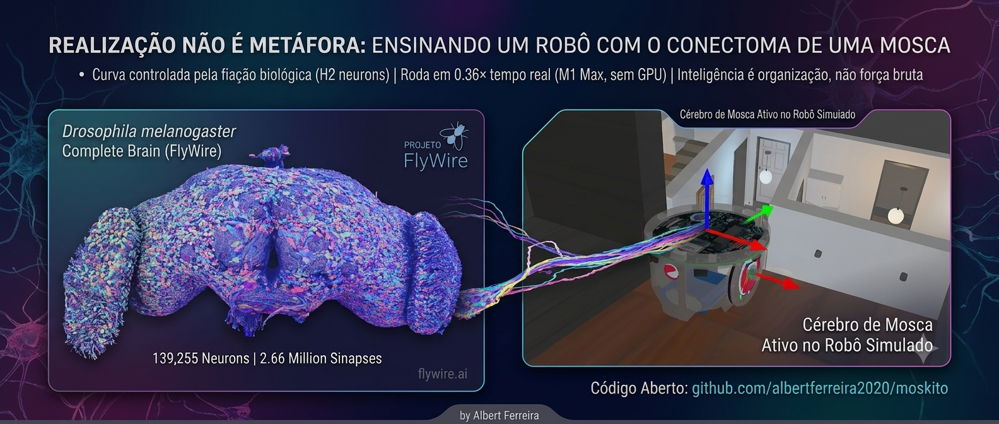

<p align="center">
  
</p>

# moskito

Um robô autônomo cujo cérebro é o conectoma real da mosca (FlyWire FAFB v783),
com os estados internos que o conectoma **não** contém.

Alvo final: robô físico com ESP32-S3 (corpo e reflexos) + cérebro rodando num
Mac M1 Max. Antes disso, tudo é validado no Webots com um apartamento simulado.

## Ideia

O conectoma dá a **fiação**: 139.255 neurônios, 2,66M conexões assinadas pelo
neurotransmissor previsto. Ele não dá dopamina, octopamina, NPF nem relógio
circadiano — e são esses sistemas, agindo por cima da fiação, que produzem
"acordar, explorar, cansar, procurar comida".

Então o projeto é feito de duas metades:

```
conectoma FlyWire   ->  moskito/connectome.py + brain.py   (a fiação, baixada)
estados internos    ->  moskito/drives.py                  (5 escalares, escritos)
portas I/O          ->  moskito/body.py                    (sensores <-> rodas)
```

**Portas.** O cérebro da mosca tem entradas e saídas nomeadas, e é por elas que
o robô se conecta — não se injeta pixel em fotorreceptor:

| Porta | Papel | Neurônios |
|---|---|---|
| `LPLC2_L/R` | looming (obstáculo se aproximando) | 108 / 102 |
| `LC11_L/R` | objeto pequeno em movimento | 66 / 61 |
| `DN_L/R` | população descendente = barramento motor | 647 / 650 |
| `MDN` | marcha ré (moonwalker) | 4 |
| `DNa02_L/R` | steering — **1 neurônio por lado** | 1 / 1 |

## Rodando

```bash
python3 -m venv .venv && .venv/bin/pip install -r requirements.txt
bash scripts/fetch_data.sh     # ~55 MB do espelho público do Codex
.venv/bin/python scripts/build.py       # CSVs -> data/brain.npz (~6 s)
.venv/bin/python scripts/trace.py       # qual porta tem influência lateralizada
.venv/bin/python scripts/calibrate.py   # faixa dinâmica e lateralização
.venv/bin/python scripts/demo.py        # um dia da mosca em 20 min -> demo.png
```

## Estado atual

**Funciona:**

- Pipeline completo: CSV -> matriz esparsa assinada -> LIF -> rodas.
- Runtime LIF orientado a eventos, **0,36x tempo real** no M1 Max. Suficiente
  para um loop de decisao a ~10 Hz; reflexos ficam locais, nunca aqui.
- **Steering vem do conectoma.** Estimulo em `H2` de um lado produz assimetria
  **+0,228 / -0,218** na populacao descendente -- espelhada e contralateral, ou
  seja, obstaculo a esquerda faz virar para a direita.
- Ciclo circadiano + pressao de sono produzem o padrao certo: ativo ao
  amanhecer e ao entardecer, quase parado de madrugada.
- Webots: apartamento simulado, corpo cogumelar dando novidade de lugar a
  partir da camera, complexo central dando rumo, frustracao -> MDN (marcha re),
  escalada de fuga e busca por pessoa.

**A descoberta que destravou o passo 4.** `scripts/trace.py` mede, por
propagacao linear no grafo, a influencia de cada porta sensorial sobre os
descendentes esquerdos e direitos. Resultado:

| fonte (esq) | ->DN_L | ->DN_R | assimetria |
|---|---|---|---|
| **H2** | 0,105 | **0,425** | **+0,603** contralateral |
| HSS | 0,071 | 0,042 | -0,260 |
| LPLC2 | 0,0068 | 0,0014 | -0,658 |
| LC4 | 0,0196 | 0,0028 | -0,753 |

`LPLC2` era a porta errada: influencia 60x menor que `H2` e do lado errado. E'
a via de looming -> fibra gigante -> **fuga**, nao de steering. `H2` e' a celula
tangencial da placa lobular que projeta contralateralmente. Rodar esse tracado
custa 1,3 s e responde o que o spiking levaria minutos para responder: se nao ha
caminho lateralizado no grafo, nenhuma calibracao de `W_SYN` vai criar um.

**O bug de escala.** `W_SYN = 1.0` dava taxa media "plausivel" (~11 Hz) mas com
`i_syn` em **-1800 mV** contra limiar de 7 mV: regime saturado onde excitacao e
inibicao gigantes se cancelam e a injecao sensorial e' irrelevante. Calibrar
pela taxa media engana. O alvo certo e' a **lateralizacao**. Em `W_SYN = 0.18`
a resposta e' limpa e espelhada.

**O avanço deixou de ser comando (0.3.0).** Antes o robô andava porque o
software mandava: `V_CRUISE * drive_forward()`, mais 11 mV injetados direto no
`DNp09`. Agora a velocidade é uma **leitura** da mesma população descendente
que já dava o steering — a soma é o avanço, a diferença é a curva:

```
forward = K_V * max(0, (DN_L + DN_R) - VNC_RECRUIT)
turn    = f((DN_R - DN_L) / (DN_R + DN_L))
```

Nenhum estado interno toca motor. Eles injetam corrente em núcleos que existem
no FlyWire — s-LNv, LNd, OA-VUM/VPM, PAM, PPL1, ER5+dFB — e a excitação tem de
atravessar 139.255 neurônios para virar movimento. O que faltava era a
aferência tônica: com os 17.550 mecanossensoriais ativos, o `DNp09` passa a
disparar a **19,45 Hz**, contra "não dispara nem com injeção acima do limiar".
Ver [CHANGELOG.md](CHANGELOG.md).

**Nao funciona ainda:**

- **O ponto de operação do avanço não convergiu.** A arquitetura está no lugar,
  a calibração não. Em traço de 40 s os estados internos não diferenciam:
  explorando 1,52 Hz, lugar conhecido 1,48 Hz, dormindo 1,36 Hz — mosca
  dormindo anda a 6,3 cm/s. São quatro parâmetros acoplados (`W_SYN`, `TONIC`,
  `B_SLOW`, `K_MOD`) e falta a busca nesse espaço.
- **A rede latcha sem adaptação lenta.** Descoberto ao rodar 20 s: nenhum
  script do projeto passava de 1 s, e o `W_SYN = 0,18` foi calibrado com
  350 ms. Um pulso de octopamina leva os descendentes a ~2,3 Hz e eles ficam lá
  depois que o pulso acaba.
- Sem porta olfativa de verdade: o "cheiro" da base entra pelas LC11. Falta
  resolver os ORNs do lobo antenal.
- `Compass` modela o *resultado* do anel EPG/PEN, não a dinâmica de spikes.
  EPG/PEN/Delta7 estão no conectoma (47/24/42) e a classe pode ser trocada.

**Parametros de calibracao** (nada disso vem dos CSVs -- o conectoma da
anatomia, nao fisiologia): `W_SYN`, `V_TH`, `TAU_M`, `TAU_SYN`, `B_ADAPT`,
`B_SLOW`, `K_MOD` em `brain.py`; `K_V`, `VNC_RECRUIT`, `K_ANGULAR` em
`body.py`; `TONIC` e os `M_*` em `drives.py`.

## Tempo comprimido

Um dia da mosca = 20 minutos de relógio de parede (`DAY_MINUTES` em
`drives.py`), fator 72×. Dá para ver o ciclo sono/vigília inteiro numa sessão.
O tempo biológico do cérebro e o tempo dos estados internos são escalas
separadas de propósito: o cérebro é o processo rápido, os estados são o
envelope lento.

## Dados

FlyWire FAFB v783, baixado do espelho público do Codex. Licença **CC BY-NC 4.0**
— uso não comercial. Citação conforme <https://flywire.ai/guidelines>.
Os CSVs não são versionados (~230 MB); use `scripts/fetch_data.sh`.
